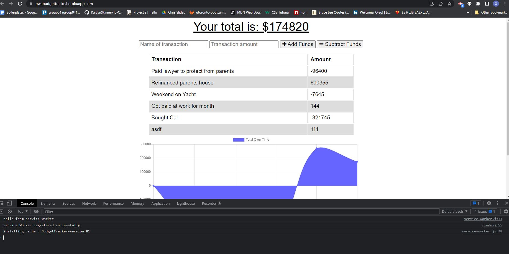

# PWA - Budget Tracker

# Student Id.
# Oleg Dobrovolskyi

# Repository Link
https://github.com/MrBearSir/BudgetTrackerPWA

# Deployed Live
https://pwabudgettracke.herokuapp.com/

# Project type.
Progressive Web Applications (PWA)

# User Story.
AS AN avid traveler
I WANT to be able to track my withdrawals and deposits with or without a data/internet connection
SO THAT my account balance is accurate when I am traveling 

# Skills used in development.
<ul>
<li>App is built on MongoDb Data Base with Mongoose ODM.</li>
<li>Express and Mongoos packages.</li>
<li>Using MongoDb Atlas to work with db's.</li>
<li>VS Code used as source code editor. </li>
<li>Created service workers to manage app in offline/online modes.</li>
</ul>